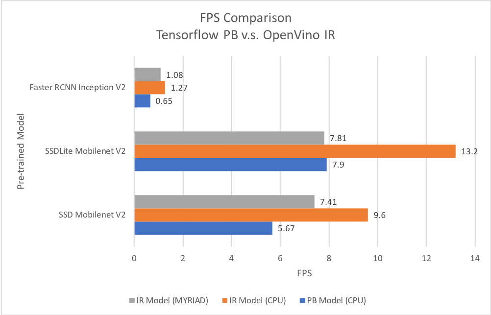
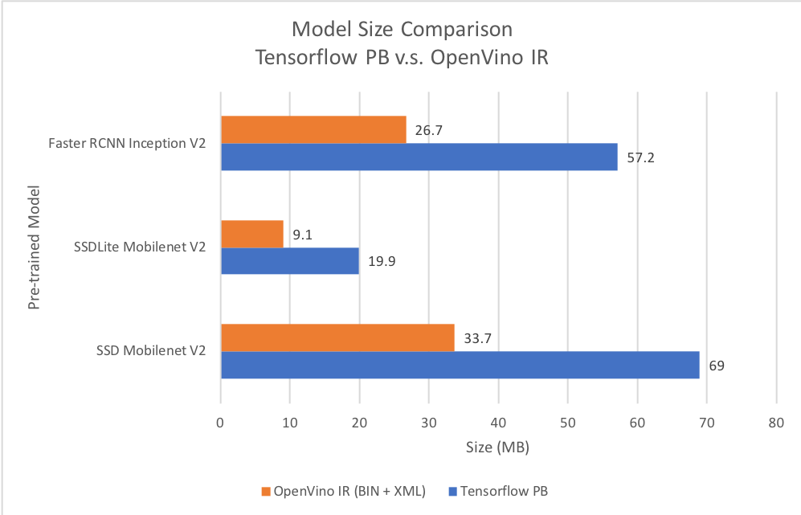
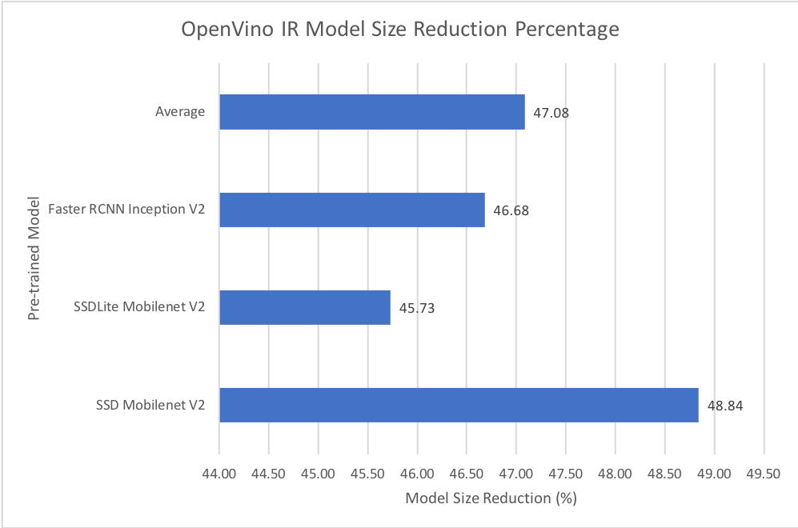
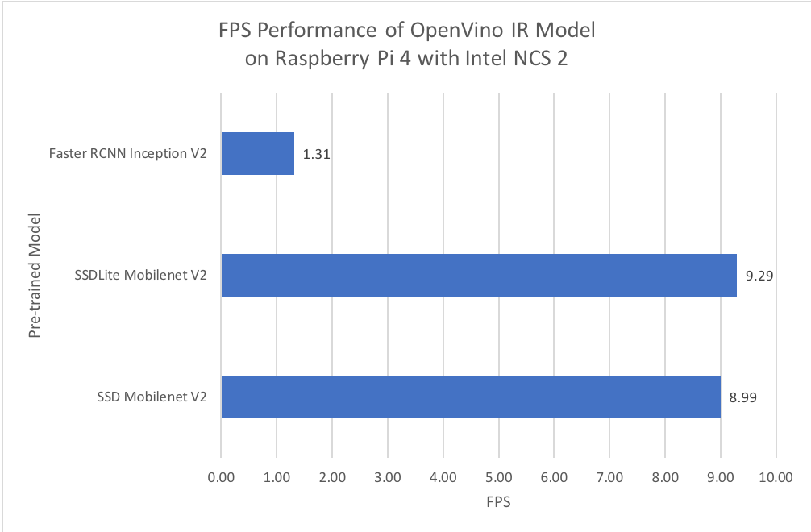
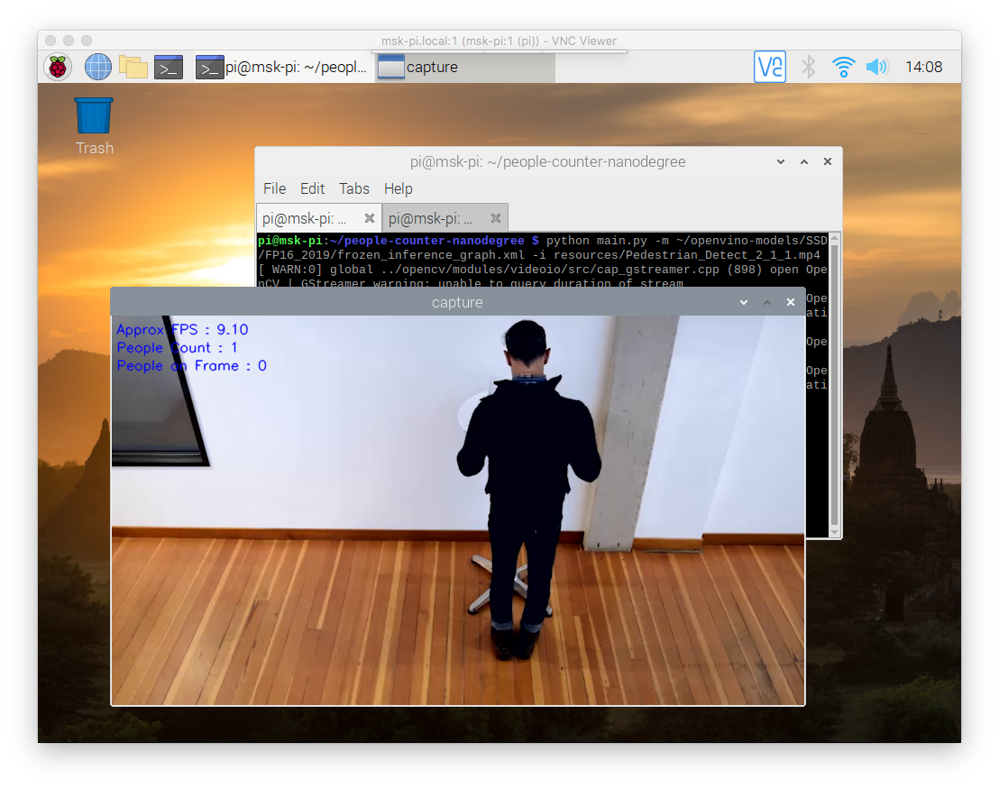

# Project Write-Up

You can use this document as a template for providing your project write-up. However, if you
have a different format you prefer, feel free to use it as long as you answer all required
questions.

## Explaining Custom Layers

The custom layers are layes that not listed in known layers according to model optimizer in OpenVino Toolkit. It will return an error if the custom layers loads into inference engine. The layers it self is a abstract concept of a math function that is selected for a specific function. Therefore, we can assume that custom layers are mathematical function that currently unknown by model optimizer and inference engine.

We can devide custom layer implementation workflow into 2 categories.

1. Custom layer extensions for the model optimizer
2. Custom layer extension for the inference engine

### Custom Layer Extension for the Model Optimizer


The workflow in this categories consist of 3 main step. Model extraction, model optimaztion, and model ir generation. In model extraction, MO will extract all of information from input model including the topology along with parameters, input, and output. During this process, MO will extract the know layers first. If unknown layer was found, then we need custom layer extractor to handle the custom layers parameters. In model optimazion the working process is pretty same with model extraction. It will check the attribute of the known layers first, then it will utilized custom layer operation if custom layers was found. The model optimazion will compute the output shape for each layer including custom layer.

### Custom Layer Extension for Inference Engine


Inference engine custom layer workflow is pretty simple. We just need to load the compiled shared library that include custom layers. We called it the extension. It can be for CPU or GPU.

### Custom Layer in Tensorflow
Since i'm using tensorflow model, i'll give additional information about custom layer in tensorflow model. In tensorflow model, OpenVino give us 2 options to utilized custom layer.

1. By register the custom layer to model optimizer, or
2. By replacing the sub-graph

We can replacing the sub-graph by using extra option in the model optimizer command.

For 2019.R3.1

`--tensorflow_use_custom_operation_config`

For 2020.x

`--tensorflow_custom_operations_config_update`

The great potensial use of custom layers is an opportunity that OpenVino give us to create our own layers based our own research. It also give us a chance to implement it into edge.

References :
1. https://docs.openvinotoolkit.org/latest/_docs_HOWTO_Custom_Layers_Guide.html
2. https://docs.openvinotoolkit.org/latest/_docs_MO_DG_prepare_model_customize_model_optimizer_Subgraph_Replacement_Model_Optimizer.html
3. https://docs.openvinotoolkit.org/latest/_docs_MO_DG_prepare_model_customize_model_optimizer_Customize_Model_Optimizer.html
4. https://docs.openvinotoolkit.org/latest/_docs_MO_DG_prepare_model_convert_model_Convert_Model_From_TensorFlow.html
5. https://www.youtube.com/watch?v=QW6532LtiTc
6. https://www.youtube.com/watch?v=cbdS3BjjbaQ

## Comparing Model Performance

I setup some environtment to test the model performance. The FPS and model size are used to compare the performance. I choose 3 tensorflow pretrained object detection models, which are SSD Mobilenet V2, SSDLite Mobilenet V2, and Faster RCNN Inception V2. All of them was trained using COCO dataset with 90 objects. Since, I only have 3rd gen of intel core processor, and I face some issue with OpenVino 2020.x regarding model optimizer and CPU extension, I decide to use OpenVino 2019R3.1. 

```
I convert all the models using 2019R3.1 version of model optimizer. After some trial and error, and also doing some research, it found that IR model that comes from 2020.x model optimizer cannot run on 2020.x raspberry version of OpenVino. I tried both 2020.1 and 2020.2 raspberry version and it return `furute version error`.

I also set the precision to FP16
```

I put the code for testing in **performance-test** [branch](https://github.com/hndr91/people-counter-nanodegree/tree/performance-test). For the OpenVino model, just run the `main.py` on root directory. For the Tensorflow model, go to `tf-compare` directory and run `main.py`. I similirar to master branch, except for MQTT features and average FPS calculation.

The first environment is on the PC. I use

- Intel(R) Core(TM) i3-3240
- RAM 4GB
- Ubuntu 18.04
- OpenVino 2019R3.1
- TensorFlow 2

The second enviroment is on the same PC, but I utilized Intel NCS 2 / Intel® Movidius™ Myriad™ X VPU

The third enviroment is on Respberry Pi 4 with 2GB of RAM and I also utilized Intel NCS 2. However, I'm using OpenVino 2020.1 for raspberry.

### FPS Calculation Strategy

I think my method to calculate FPS is tend to calculate the FPS during the inference process. I put FPS between inference process. Therefore, I may call the result an average inference FPS.

### Result






I found some interesting fact. Intel NCS2 perform better in Raspberry Pi 4 comparing to PC accoriding to FPS. They share same IR model that comes from 2019R3.1 model optimizer. However, the PC use 2019R3.1 version of inference engine and the raspberry use 2020.1.

## Assess Model Use Cases

We can leverage people counter app into many use cases. I found 2 use cases that may easily to implement with little modification. The first is social distancing alert. Social distancing is major issue due COVID-19. We can extract information about people who don't follow social distancing by detecting the overlapping boxes. I know this is simple method but we can enhance the method by calculating the actual distance between each box. However, we should undestand how to convert camera coordinates to world coordinates to get the exact distance. It also may require camera calibration before take the action.

The second is measure queueing time. I think this use case is usefull. Based on current people counter app, we just need to send average of queueing time to MQTT server and perform some alern to users who subscribe to the topic. This is usefull because, we don't need to line up. The app become more powerfull if we can send the information about how many people who already in queue. So, by doing simple multiplication on average queueing time and number of people, we know the exact amount of time that we can use in other thing before join the queue.

## Assess Effects on End User Needs

I concern on lighting, camera angle, and image size may affect the deployed edge model. In this project, I found some issue during detection. One people on the video (the second one) is not properly detected by the model, even from the original Tensorflow model. These element may play vital role, especially during training process. If we want to get better peformance especially in accuracy, we might setup same condition during training and deploying process.

## Model Research

[This heading is only required if a suitable model was not found after trying out at least three
different models. However, you may also use this heading to detail how you converted 
a successful model.]

In investigating potential people counter models, I tried each of the following three models:

- Model 1: [SSD Mobilenet V2 Coco](https://github.com/tensorflow/models/blob/master/research/object_detection/g3doc/detection_model_zoo.md)
  - [Model Source](http://download.tensorflow.org/models/object_detection/ssd_mobilenet_v2_coco_2018_03_29.tar.gz)
  - I converted the model to an Intermediate Representation with the following arguments
    - `--input_model`
    - `--tensorflow_use_custom_operations_config` : for custom subgraph, because I use SDD that require special custom subgraph. I also use this argument because I use 2019R3.1 model optimizer
    - `tensorflow_object_detection_api_pipeline_config` : for tensorflow pipeline config
    - `--reverse_input_channels` : switch the input to BGR since I use OpenCV to read the image
    - `--data_type FP16` : i set the precision to FP16 since I want the model also work with Intel NCS2
    - `--output_dir`

  - In my opinion, the model is good enough.
  
- Model 2: [SSDLite Mobilenet V2 Coco](https://github.com/tensorflow/models/blob/master/research/object_detection/g3doc/detection_model_zoo.md)
  - [Model Source](http://download.tensorflow.org/models/object_detection/ssdlite_mobilenet_v2_coco_2018_05_09.tar.gz)
  - I converted the model to an Intermediate Representation with the following arguments
    - `--input_model`
    - `--tensorflow_use_custom_operations_config` : for custom subgraph, because I use SDD that require special custom subgraph. I also use this argument because I use 2019R3.1 model optimizer
    - `tensorflow_object_detection_api_pipeline_config` : for tensorflow pipeline config
    - `--reverse_input_channels` : switch the input to BGR since I use OpenCV to read the image
    - `--data_type FP16` : i set the precision to FP16 since I want the model also work with Intel NCS2
    - `--output_dir`

  - In my opinion, the model is good enough and fast

- Model 3: [Faster RCNN Inception V2](https://github.com/tensorflow/models/blob/master/research/object_detection/g3doc/detection_model_zoo.md)
  - [Model Source](http://download.tensorflow.org/models/object_detection/faster_rcnn_inception_v2_coco_2018_01_28.tar.gz)
  - I converted the model to an Intermediate Representation with the following arguments
    - `--input_model`
    - `--tensorflow_use_custom_operations_config` : for custom subgraph, because I use SDD that require special custom subgraph. I also use this argument because I use 2019R3.1 model optimizer
    - `tensorflow_object_detection_api_pipeline_config` : for tensorflow pipeline config
    - `--reverse_input_channels` : switch the input to BGR since I use OpenCV to read the image
    - `--data_type FP16` : i set the precision to FP16 since I want the model also work with Intel NCS2
    - `--output_dir`

  - The model was insufficient for the app because is too slow with machine specification. It may good in accuracy, but it has heavy computational process.


In the future, I want to retrain these model only with person label. I hope the result getting better since it only learn and detect single object.
